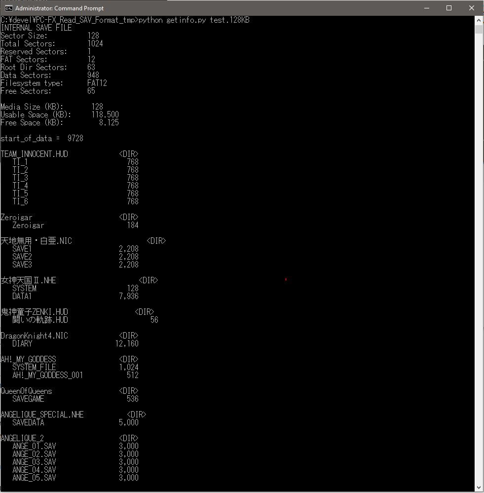

# PC-FX_Read_SAV_Format

This is a script written in Python to extract the contents of a PCFX 'sav' file to the
local computer.

## Script

The script was built only to extract the contents of a PC-FX sav file, not to re-implant
the contents.  Although you could already view the contents of the files with a specific
template I had written/modified for the excellent "010 Editor", it was not particularly
straightforward.

This script should work with both FAT-12 and FAT-16 variants of the PC-FX cartridges, and
will extract all files into the local area.

Each game creates a directory within the root directory, and may create files within that
directory; I have not seen any games which create subdirectories.  The directory entry
format is slightly different than the standard Microsoft FAT format - in order to accomodate
filenames which are both long and SJIS.  [The PCFX FAT format is documented here]
(https://github.com/pcfx-devel/PC-FX_Info/blob/main/FX-BMP/FX_Backup_Mem_Format.md)

### Usage:

```
   Usage: getinfo <input_file>

   Example:
     python getinfo.py pcfxbmp.bin
```


### Sample Output:




### Limitations/Known Issues

- Currently, the script is written for only 1 level of directory depth. This means that it
will only create directories within the root directory (not within subdirectories), and it
will only create files within the subdirectories (not in the root directory).
  - One reason this was done because all of the sample data from published PC-FX games
matched this layout
  - Another reason was because multi-dimensional arrays in Python are less straightforward
than in many other programming languages

- Testing has only been performed on 128KB files so far, but 24 games were represented

- While FAT16 should be supported (for SAV files of 1MB or 2MB), these have not yet been tested

- This program will likely require changes in order to support 2MB files, as they use a
2-sector cluster size, where all other cartridge sizes use only 1-secotr clusters


